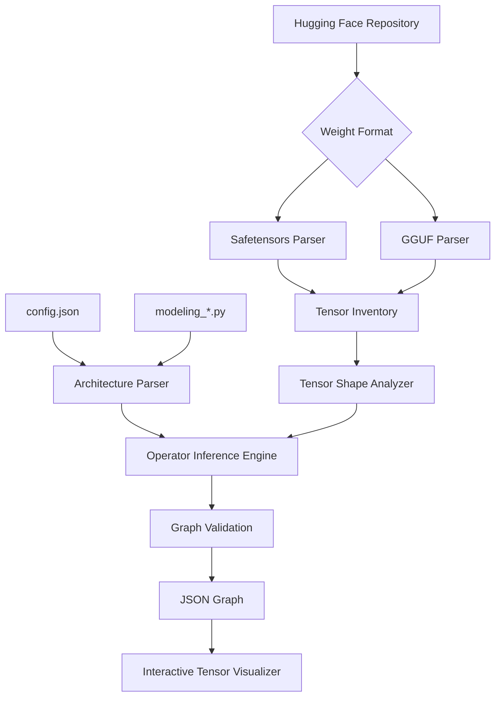

```mermaid
flowchart TD
    A[Hugging Face Repository] --> B{Weight Format}
    B --> C[Safetensors Parser]
    B --> D[GGUF Parser]
    C --> E[Tensor Inventory]
    D --> E
    F[config.json] --> G[Architecture Parser]
    H[modeling_*.py] --> G
    E --> I[Tensor Shape Analyzer]
    G --> J[Operator Inference Engine]
    I --> J
    J --> K[Graph Validation]
    K --> L[JSON Graph]
    L --> M[Interactive Tensor Visualizer]
```